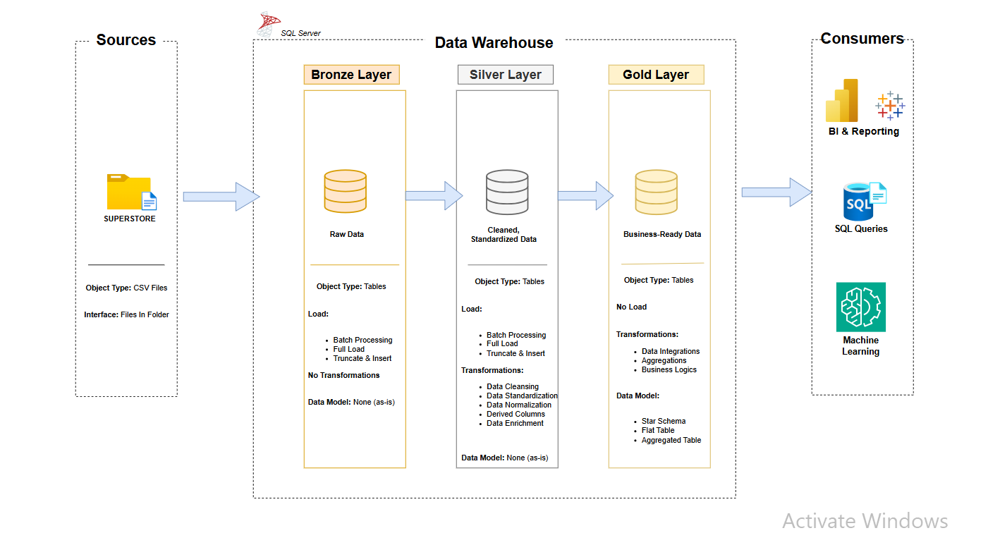

Superstore Data Warehouse and Analytics Project
-----

**Welcome to the Superstore Data Warehouse and Analytics Project repository!**

This project demonstrates the development of a SQL Server data warehouse and analytics solution, from raw data ingestion and transformation to the creation of business-ready data models and analytical insights.
The project applies the Medallion Architecture (Bronze, Silver, and Gold layers) to organize, clean, transform, and prepare Superstore sales data for analysis and reporting. As a portfolio project, it demonstrates practical skills in SQL, data warehousing, ETL, dimensional modeling, data cleaning, and business analysis.

------
Data Architecture
----

The data architecture for this project follows Medallion Architecture Bronze, Silver, and Gold layers:



1. **Bronze Layer:** Stores raw data as-is from the source systems. Data is ingested from CSV Files into SQL Server Database.
2. **Silver Layer:** This layer includes data cleansing, standardization, and normalization processes to prepare data for analysis.
3. **Gold Layer:** Houses business-ready data modeled into a star schema required for reporting and analytics.

------------
 Project Overview
 ---
This project involves:

1. **Data Architecture:** Designing a modern data warehouse using the Medallion Architecture, consisting of Bronze, Silver, and Gold layers.
2. **ETL Pipelines:** Extracting, transforming, and loading Superstore data from source files into the data warehouse.
3. **Data Modeling:** Developing dimension and fact tables to organize data for efficient analytical queries.
4. **Analytics & Reporting:** Performing SQL-based analysis to generate business insights related to sales, customers, products, profitability, returns, and regional performance.


-------
Project Requirements
--
**Building the Data Warehouse (Data Engineering)**

**Objective**

Develop a modern data warehouse using SQL Server to organize and transform Superstore sales data, enabling efficient analytical queries and business decision-making.

**Specifications**

- **Data Source:** Import Superstore sales data provided as CSV files into the SQL Server data warehouse.
- **Data Quality:** Identify and resolve data quality issues, including duplicates, inconsistent values, incorrect data types, and missing or invalid data.
- **Data Integration:** Transform and integrate the source data into a structured data warehouse consisting of Bronze, Silver, and Gold layers.
- **Data Modeling:** Develop business-ready dimension and fact tables in the Gold layer to support analytical queries.
- **Scope:** Focus on the available Superstore dataset; historical data tracking and Slowly Changing Dimensions (SCD) are not required for this project.
- **Documentation:** Provide clear documentation of the data architecture, data catalog, data flow, data model, and naming conventions to support understanding and future analysis.

-----
BI: Analytics & Reporting (Data Analysis)
--

**Objective**

Develop SQL-based analytics to generate actionable business insights and evaluate key performance indicators across different areas of the Superstore business.

**The analysis focuses on:**

- **Sales Performance —** Analyze sales trends, growth, and performance across different periods and regions.
- **Profitability —** Evaluate total profit and profit margins to identify profitable and loss-making areas.
- **Customer Analysis —** Analyze customer segments, purchasing behavior, and customer contribution to sales and profit.
- **Product Performance —** Identify top- and bottom-performing products, categories, and sub-categories.
- **Returns Analysis —** Evaluate returned orders and their impact on sales and profitability.
- **Geographic Performance —** Analyze sales and profitability across countries, states, cities, and regions.
- **Regional Manager Performance —** Evaluate sales and profitability across regional managers.

These analyses provide stakeholders with key business metrics and actionable insights to support informed decision-making.

-----
Business Reporting
----
The `business_report` folder serves as the main analytical reporting layer of the project.

Rather than only writing individual SQL queries, the analysis is organized into structured business reports that answer specific business questions and provide supporting query results.

Each report focuses on a particular area of the business and may include:

- Key performance indicators (KPIs)
- Business questions
- Overall performance analysis
- Segmentation by relevant business dimensions
- Trend analysis
- Comparative analysis
- Financial impact analysis
- Query results and supporting screenshots

This approach demonstrates how SQL can be used not only to retrieve data, but also to structure analysis around real-world business questions and communicate findings to stakeholders.

-----------
----
## 📁 Repository Structure

```text
sql-superstore-analysis/
│
├── business_report/                    # Business-focused SQL analysis and results
│   ├── customers_report.sql             # Customer analysis and insights
│   ├── customers_result.png             # Customer analysis results
│   ├── products_report.sql              # Product performance analysis
│   ├── products_result_1.png            # Product analysis results
│   ├── products_result_2.png            # Additional product results
│   ├── returns_report.sql               # Returns analysis
│   ├── returns_overall_report.png       # Overall returns results
│   ├── sales_report.sql                 # Sales and revenue analysis
│   ├── sales_result_1.png               # Sales analysis results
│   └── sales_result_2.png               # Additional sales results
│
├── data_analytics_techniques/           # SQL techniques used for deeper analysis  
│   ├── exploratory_data_analysis.sql    # Explore patterns, trends, and data quality
│   └── advanced_analysis.sql            # Advanced SQL analysis and business insights
|
├── datasets/                           # Raw datasets used for the project
│
├── docs/                               # Project documentation
│   ├── data_architecture.drawio        # Draw.io file for the project architecture
│   ├── data_catalog.md                 # Data catalog and field descriptions
│   ├── data_flow.drawio                # Data flow diagram
|   ├── data_integration.drawio         # Data integration diagram
│   ├── data_models.drawio              # Data model / star schema
│   └── naming_conventions.md           # Naming conventions
│
├── scripts/                            # SQL scripts for ETL and transformations
│   ├── bronze/                         # Scripts for loading raw data
│   ├── silver/                         # Scripts for cleaning and transforming data
│   └── gold/                           # Scripts for analytical models
│
├── tests/                              # Data quality and test scripts
│
├── README.md                           # Project overview
└──LICENSE                              # License information
└── 
```
----

License
--
This project is licensed under the MIT License. You are free to use, modify, and share this project with proper attribution.

-----
About Me
-----
Hi, I'm Happiness 👋

I'm a Business Administration graduate transitioning into Data Analytics, combining my business background with technical skills to understand and solve business problems using data.

My current focus is on:

- **SQL & SQL Server**
- **Excel**
- **Power BI**
- **Data Cleaning & Transformation**
- **Data Warehousing**
- **Business & Sales Analysis**

I enjoy working on projects that turn raw data into meaningful insights and business-ready information.

This Superstore SQL Data Warehouse Project is part of my hands-on learning journey, where I applied the Medallion Architecture (Bronze, Silver, and Gold) to build a structured data warehouse and perform business-focused analysis.

A key part of the project is the Business Reporting layer, where I transformed the warehouse data into structured analytical reports covering sales, customers, products, returns, profitability, and regional performance. This allowed me to connect technical SQL development with practical business questions and stakeholder-focused analysis.

## Let's Stay in Touch!

Feel free to connect with me on LinkedIn:

[](https://www.linkedin.com/in/happiness-oruameh-90a26a246/)
